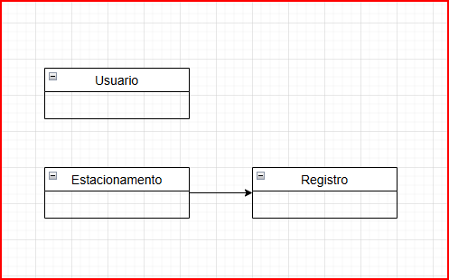

# ADA Estacionamento - Programação Web II

## Descrição
Projeto de estacionamento para a disciplina de Programação Web II

Construir uma API Rest para controlar veículos em um estacionamento e controlar o valor a pagar conforme o tempo de permanência

Abrir o estacionamento com um limite de vagas.
Para um carro entrar ou saír no estabelecimento, a sua placa deverá ser fornecida ao sistema, 
caso não houver nenhuma outra entrada em aberto para aquela placa, o sistema deverá registrar a entrada do veículo.
Caso contrário deverá ser registrado a saída do veículo e o valor a ser pago.
Permitir extrair relatórios de veículos que passaram e estão no estacionamento.

---
## Objetivo

- Aplicar o conhecimento adquirido sobre Programação Web II
- Aplicar o conhecimento sobre Spring Boot Web para expor endpoints de uma API Rest
- Aplicar o conhecimento sobre Spring Data JPA para persistência dos dados
- Aplicar o conhecimento sobre Spring Security para autenticação básica dos usuários
- Aplicar o conhecimento sobre Beans Validation para validar os dados recebidos nos endpoints
- Ler e interpretar enunciados.

---
## Enunciado

### Requisitos
Criação de uma API Web Rest para controlar veículos em um estacionamento.

 O sistema deve ser capaz de:

  - Abrir o estacionamento com um limite de vagas
  - Permitir a entrada e saida de veículos no estacionamento
  - Controlar o tempo de permanência de cada veículo no estacionamento
  - Controlar a lotação do estacionamento
  - Calcular o valor a ser pago pelo cliente baseado no tipo de veículo
  - Exibir um relatório com as informações de todos os veículos que passaram pelo estacionamento
  - Ser extensível para adicionar novos tipos de veículos
  - Permitir o cadastro de usuários para acesso à API
  - Usar autenticação básica para acesso às funcionalidades

Funcionalidades:

- Cadastrar usuários
- Iniciar o estacionamento
- Registrar entrada/saída de veículos
- Controlar a lotação do estacionamento
- Calcular valor a ser pago
- Exibir relatório de veículos no estacionamento e que passaram por ele
- Validar todos os dados de entrada

Obs. O estacionamento é aberto diariamente e pode ter um limite de vagas diferente para cada dia.

### Regras de Negócio

> **RN1** - O endpoint para cadastrar usuários deve ser publico.

> **RN2** - Todos os outros endpoints devem ser protegidos por autenticação.

> **RN3** - O estacionamento possui um limite de vagas que deve ser informado no momento da inicialização.

> **RN4** - O estacionamento não deve permitir a entrada de veículos quando estiver lotado.

> **RN5** - O estacionamento deve permitir apenas veículos do tipo Carro e Moto, mas deve ser extensível para outros tipos de veículos.

>  ### Regra de negócio para calcular o valor a ser pago:
> - De 0 a 5 minutos não é cobrado nenhum valor.
> - Carro: R$ 5,00 a hora. A cada fração de hora é cobrado uma hora cheia.
> - Moto: R$ 3,00 a hora. A cada fração de hora é cobrado uma hora cheia.

### Estrutura do Projeto

  O projeto deve ser construído em Java usando Spring Framework.
  - Spring Boot Web para criar API Rest.
  - Spring Data JPA para persistência dos dados.
  - Spring Validation para validações dos dados nos endpoints
  - Spring Security para autenticação básica dos usuários com usuário e senha ou com JWT
  - Banco de dados H2 em memória.

  Expor endpoints para:

  - Cadastrar e editar e listar usuários
  - Iniciar o estacionamento com um limite de vagas
  - Registrar Veículos (entrada ou saida)
  - Relatório de veículos que passaram pelo estacionamento

  Entidades:

  - Usuario
  - Estacionamento
  - Registro

  
### Entrega
O projeto deve ser entregue via LMS em um arquivo compactado com o nome do aluno.

