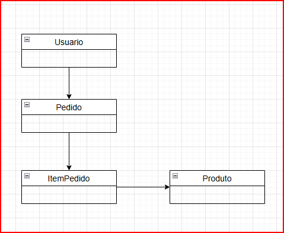

# ADA Pedido De Compra - Programação Web II

## Descrição
Projeto pedido de compra para a disciplina de Programação Web II

Construir uma API Rest para receber pedido de compras

Para um cliente realizar um pedido de compras, o cliente deve se cadastrar no sistema.
A API deve receber uma lista de items com o ID do produto, a quantidade.
É necessário verificar se o produto existe e se há estoque suficiente para atender o pedido.

---
## Objetivo

- Aplicar o conhecimento adquirido sobre Programação Web II
- Aplicar o conhecimento sobre Spring Boot Web para expor endpoints de uma API Rest
- Aplicar o conhecimento sobre Spring Data JPA para persistência dos dados
- Aplicar o conhecimento sobre Spring Security para autenticação de usuários
- Aplicar o conhecimento sobre Beans Validation para validar os dados recebidos nos endpoints
- Ler e interpretar enunciados.

---
## Enunciado

### Requisitos
Construir uma API Rest para receber pedido de compras

O sistema deve ser capaz de:

  - Cadastrar Clientes
  - Cadastrar Produtos
  - Realizar Pedidos
  - Ação 1, validar o estoque do produto
  - Ação 2, dar baixa no estoque do produto
  - Ação 3, enviar email de confirmação do pedido para o cliente
  - Ser extensível para adicionar novas ações sobre os pedidos, como emitir NF, etc.

Funcionalidades:

- Cadastrar o cliente
- Validar nome, cpf e email
- Cadastrar o produto
- Validar nome, preço e estoque
- Realizar o pedido de compras

- O cliente precisa realizar login
- Salvar o pedido
- Validar o estoque
- Dar baixa no estoque
- Enviar um email de confirmação para o cliente

### Regras de Negócio

> **RN1** - O endpoint para cadastrar cliente deve ser publico.

> **RN2** - Todos os endpoints devem ser protegidos por autenticação.
 
> **RN3** - Um cliente é um usuário do sistema, portanto, o cliente deve ter um email e senha para acessar o sistema.
 
> **RN4** - Produto sem estoque não pode ser vendido.

### Estrutura do Projeto

  O projeto deve ser construído em Java usando Spring Framework.
  - Spring Boot Web para criar API Rest.
  - Spring Data JPA para persistência dos dados.
  - Spring Validation para validações dos dados nos endpoints
  - Spring Security para autenticação básica dos usuários com usuário e senha ou com JWT
  - Banco de dados H2 em memória.

  Expor endpoints para:

  - Cadastrar, atualizar listar e deletar clientes
  - Cadastrar, atualizar listar produtos
  - Consultar os pedidos realizados

  Entidades:

  - Usuario (Cliente)
  - Produto
  - Pedido
  - ItemPedido

  
### Entrega
O projeto deve ser entregue via LMS em um arquivo compactado com o nome do aluno.

